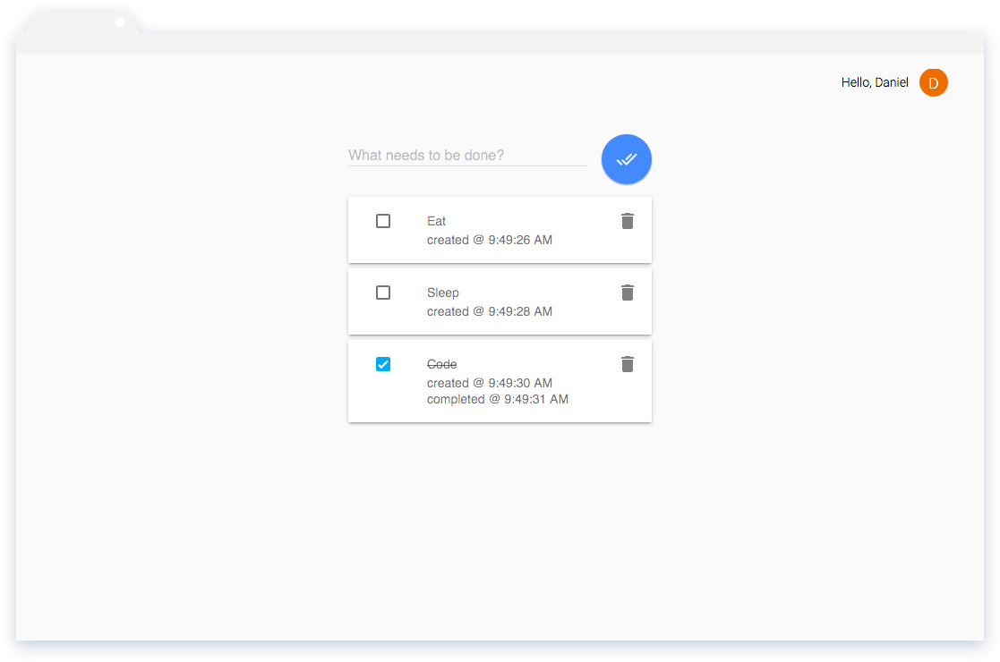

# webstack

A boilerplate stack for building Javascript Single Page Applications. Built on top of Node, Gulp, Express, Backbone and Material Design Lite. Backbone has been augmented with selected patterns to perform view life cycle management.

## Install

    git clone https://github.com/danrpts/webstack.git
    cd webstack
    npm install -g gulp express
    npm install

## Usage

A demo todo list comes installed in the webstack/webclient/webtasks directory. To build the demo and watch it for changes, simply run the following gulp task:

    gulp --client webtasks

The project is now being watched for changes, and in another terminal we can serve the it from localhost with the npm start script:

    npm start

By default the application hosted at [http://localhost:3000](http://localhost:3000).

## Authentication

When authenticating with Google OAuth2 you must update the "client id" and/or "client secret" in the /webserver/config/google_config.json and /webclient/<app_name>/javascripts/config/google.json files.
