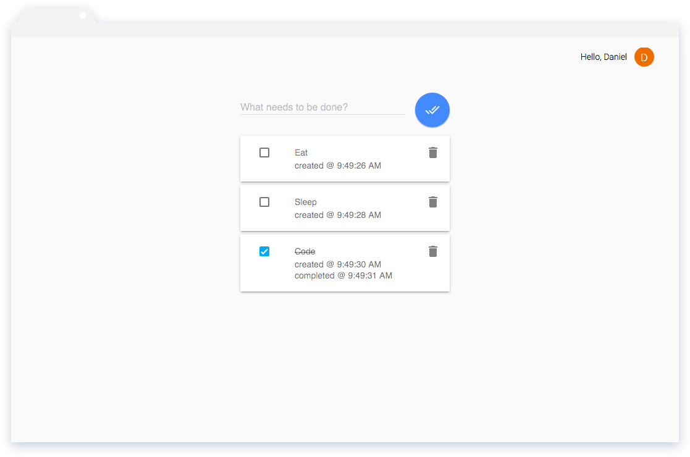

# webstack

A boilerplate stack for building Javascript Single Page Applications. Built on top of Node, Gulp, Express, Backbone and Material Design Lite. **Backbone has been augmented with selected patterns to perform view life cycle management and view composition.** Find the augmented classes in the [webclient/architecture/classes](https://github.com/danrpts/webstack/tree/master/webclient/architecture/classes) directory.

## Install

    git clone https://github.com/danrpts/webstack.git
    cd webstack
    npm install -g gulp express
    npm install

## Usage

A demo todo list comes installed in the [webstack/webclient/webtasks](https://github.com/danrpts/webstack/tree/master//webclient/webtasks) directory. To build the demo and watch it for changes, simply run the following gulp task:

    gulp --client webtasks

The project is now being watched for changes, and in another terminal we can serve the it from localhost with the npm start script:

    npm start

By default the application hosted at [http://localhost:3000](http://localhost:3000).

## Configuration
This web tasks application authenticates with OAuth 2.0 using [Google's OAuth 2.0 Client Side Flow](https://developers.google.com/identity/protocols/OAuth2UserAgent). When authenticating with Google OAuth 2.0 you must update the `client_id` and `client_secret` [credentials](https://developers.google.com/identity/protocols/OAuth2UserAgent#creatingcred) found in the following files:
 - webstack/webserver/config/google_config.json and
 - webstack/webclient/webtasks/javascripts/config/google.json

## Credits
Daniel Peterson <danrpts@gmail.com>

## License
GPLv3
